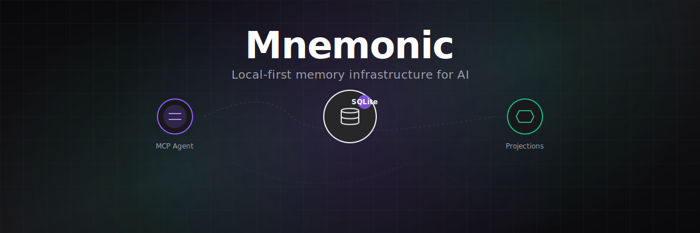
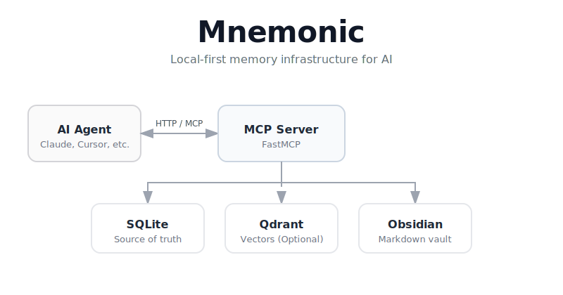

<div align="center">
  

  <br />

  # 🧠 Mnemonic: Local-first memory infrastructure for AI

  [](https://github.com/alisonglima/mnemonic/stargazers)
  [](https://opensource.org/licenses/MIT)
  [](https://python.org)
  [](https://www.docker.com/)
  [](https://modelcontextprotocol.io/)
  [](#architecture-at-a-glance)

  **Mnemonic gives AI agents a persistent, versioned, searchable memory layer that runs on your machine.**
  
  *No cloud dependency. No vendor lock-in. Just structured memory you control.*
</div>

---

## Why Mnemonic exists

AI agents forget everything between sessions. Existing solutions either push your data to third-party clouds or offer ad-hoc file-based storage with no consistency guarantees.

Mnemonic solves this by providing:

- **Structured memory** with types, namespaces, tags, and metadata — not just raw text dumps.
- **Versioned records** with optimistic concurrency — no silent overwrites.
- **Hybrid search** combining SQLite filtering with optional Qdrant vector lookup.
- **Dual-write to Obsidian** — journal entries and queued records are projected to plain Markdown.
- **Local-first architecture** — SQLite, all running on your machine.

---

## Features

| Capability | Detail |
|---|---|
| MCP tools | `memory.search`, `memory.write`, `memory.get`, `memory.update`, `memory.retract`, `memory.delete`, `memory.journal`, `memory.archive`, `memory.add_tags`, `memory.remove_tags`, `memory.append_note`, `memory.health` |
| Storage | SQLite for structured records; optional Qdrant for approximate similarity projections |
| Search | Hybrid: SQLite metadata filters + optional Qdrant vector lookup (degrades to SQLite-only) |
| Concurrency | Optimistic locking via version numbers on every mutation |
| Idempotency | Optional idempotency keys on writes |
| Obsidian sync | Async outbox pattern projects journal entries and queued records to your Obsidian vault |
| Transport | HTTP via FastMCP |
| Vector projections | Deterministic SHA-256 hash projections (8-dim, no external model) — lightweight approximation for rough grouping; not true semantic embeddings |

---

## Architecture at a glance



- **SQLite** is the source of truth. Every record, version, and tag lives here.
- **Qdrant** stores deterministic hash-based vector projections for approximate similarity lookup. Degrades gracefully if unavailable.
- **Obsidian vault** receives async projections via an outbox pattern — journal entries and queued records are readable as Markdown.
- **Vector projections** are deterministic SHA-256 hash projections (8-dim) — no external model required. These provide rough similarity grouping, not true semantic understanding.

---

## Quickstart

### Prerequisites

- Python >=3.9

### 1. Clone and install

```bash
git clone <your-org>/mnemonic.git
cd mnemonic
make setup
```

### 2. Configure

```bash
cp .env.example .env
```

Edit `.env` if you need custom paths or ports. Defaults work out of the box.

### 3. Run the MCP server

```bash
make run
```

Server starts on `127.0.0.1:8080` by default. By default, Mnemonic runs in SQLite-only mode — Qdrant is optional and not required for basic operation.

### 4. Verify

```bash
make test
```

Runs the unit test suite (22 tests). Passing tests confirm the core memory model and MCP tools are wired correctly.

---

## Optional: Enable Qdrant for approximate similarity search

Qdrant is disabled by default for host-local `make run` workflows (empty `QDRANT_URL` in `.env`). To enable Qdrant for `make run`:

1. Add a `ports` entry to the `qdrant` service in `docker-compose.yml`:
   ```yaml
   qdrant:
     image: qdrant/qdrant:v1.13.2
     ports:
       - "6333:6333"
   ```
2. Start Qdrant with Docker Compose:
   ```bash
   docker compose up -d qdrant
   ```
3. Set `QDRANT_URL=http://localhost:6333` in your `.env`.

For the full Docker Compose stack, the Mnemonic container already uses the internal `http://qdrant:6333` service URL from `docker-compose.yml`; do not set it to `localhost` inside the container. Ollama is reserved for future local-model workflows and is not used by current projection logic.

---

## Use cases

- **Personal AI assistant** — Give your agent persistent context across conversations.
- **Research companion** — Store findings, link them with tags, search by metadata and approximate similarity.
- **Development copilot** — Memory of project decisions, architecture notes, debugging sessions.
- **Journaling** — Structured journal entries projected to Obsidian for human review.

---

## Docs

| Document | Description |
|---|---|
| [Quickstart](docs/quickstart.md) | Step-by-step setup guide |
| [Docs index](docs/index.md) | Full documentation index |
| [Docker install](docs/installation/docker.md) | Run with Docker Compose |
| [Local development](docs/installation/local-dev.md) | Run directly on your machine |
| [Configuration](docs/installation/configuration.md) | Environment variable reference |
| [MCP clients](docs/guides/mcp-clients.md) | Connect any MCP-compatible client |
| [Architecture](docs/architecture/overview.md) | System design overview |
| [Troubleshooting](docs/reference/troubleshooting.md) | Common issues and solutions |

---

## Project status

**Alpha.** The core memory model, MCP tools, and dual-write pipeline are functional. API surface may change.

---

## Contributing / License

See [CONTRIBUTING.md](./CONTRIBUTING.md) for development workflow and scope rules.

See [LICENSE](./LICENSE) for the full license terms.
